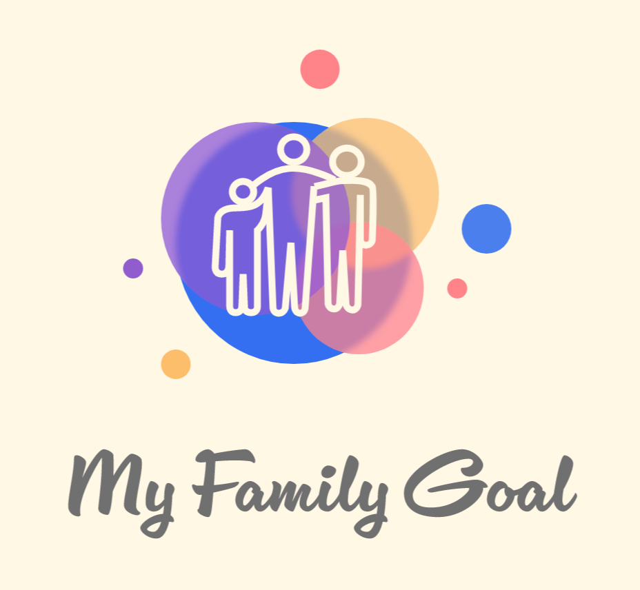

# My Family Goal

En tant que parent, on souhaite apprendre le plus de choses à nos enfants, et la gestion de l'argent en fait partie. Aujourd'hui, nous pouvons leur donner accès à des cartes de crédit très jeunes, mais pour que cet acte soit éducatif il nécessite un encadrement.

Nous souhaitons prendre la tangente, en remplaçant l'argent par un système de points, mais en intégrant en plus la notion de mérite.
Les objectifs pourront être créés par chaque utilisateur, et personnalisables avec un maximum de critères.

Une fois l'objectif rempli, l'enfant sera crédité des points correspondant, qu'il cumulera dans une cagnotte.

En parallèle, une liste de récompense sera mise en place. Chaque récompense aura un certain coût qui devra être payé avec les points de la cagnotte. Cette liste pourra être agrémentée par les parents, et chaque récompense aura sa propre valeur.

# But du projet

Projet de fin de formation destiné à mettre en pratique l'ensemble des notions abordées pendant 6 mois. Le but étant de nous confronter aux difficultés de la gestion d'un projet, d'apprendre à travailler en équipe, et de réaliser ensemble un projet complet.

# Fonctionnement

1. Démarrer avec `npm start`
2. Accéder à la page d'accueil en suivant le lien dans le terminal
   - Le premier lancement peut demander un certain temps pour le build de l'application
3. Créer son compte utilisateur
4. Créer une famille
5. Utiliser les fonctionnalitées de la page `Famille` :
   - Associer un membre à votre famille
   - Créer un objectif
   - Ajouter une récompense

# Technologies utilisées

- [REACT](https://fr.reactjs.org/)
- HTML
- SCSS
- [Material UI](https://mui.com/)
- [Redux Toolkit](https://redux-toolkit.js.org/)
- [Vite](https://vitejs.dev/)

# Auteurs

- [Adrien BLANC](https://github.com/AdrienBlanc77) : Product Owner & dev front
- [Adrien HAGGANI](https://github.com/AdrienHaggani) : Scrum master & dev front
- [Charlotte ROSE](https://github.com/rose-charlotte) : Git master & dev front
- [François G.](https://github.com/frapuks) : Lead back
- [Marwane BEN TEKAYA](https://github.com/Marwenn78) : Lead front

# Version

1. v1 (actuelle)
   - Sprint 0 : Préparation (1 semaine)
   - Sprint 1 : Architecture et authentification (1 semaine)
   - Sprint 2 : Fonctionnalités principales (1 semaine)
   - Sprint 3 : Dernières fonctionnalités et tests (1 semaine)

# API

- [Repo github](https://github.com/frapuks/my_family_goal)
- [Documentation Swagger](http://my-family-goal.duckdns.org/api-docs/)

# Ressources

Modules :
- [@emotion/react](https://www.npmjs.com/package/@emotion/react)
- [@emotion/styled](https://www.npmjs.com/package/@emotion/styled)
- [@mui/icons-material](https://www.npmjs.com/package/@mui/icons-material)
- [@mui/material](https://www.npmjs.com/package/@mui/material)
- [@reduxjs/toolkit](https://www.npmjs.com/package/@reduxjs/toolkit)
- [react](https://www.npmjs.com/package/react)
- [react-dom](https://www.npmjs.com/package/react-dom)
- [react-material-ui-carousel](https://www.npmjs.com/package/react-material-ui-carousel)
- [react-redux](https://www.npmjs.com/package/react-redux)
- [react-router-dom](https://www.npmjs.com/package/react-router-dom)

Outils :
- [VS Code](https://code.visualstudio.com/) : IDE
- [Figma](https://www.figma.com) : Wireframe / Maquette
- [Trello](https://trello.com/) : Organisation Kanban
- [Slack](https://slack.com/) : Communication écrite
- [Discord](https://discord.com/) : Communication vocale et partage d'écran